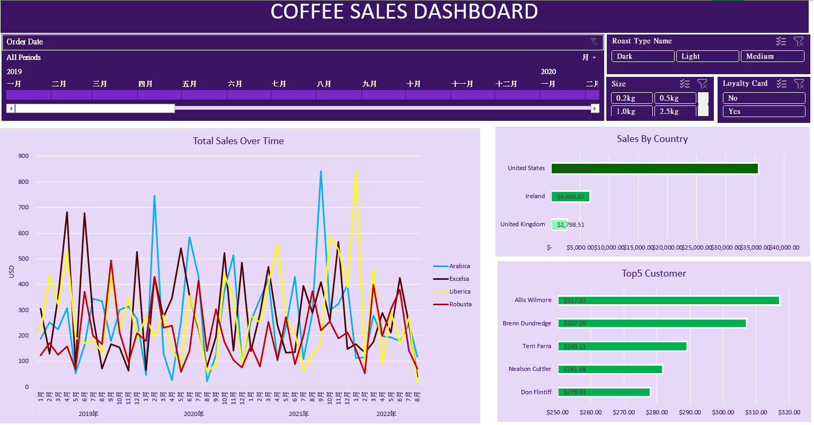
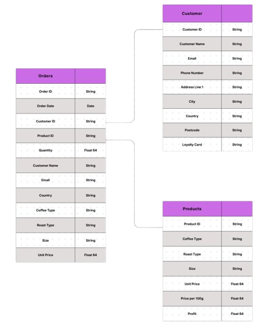

# Company X coffee sales analysis (2019-2022)

Analyzing Company X coffee sales trends from 2019-2022. Interactive Excel dashboard on [here](Profolio_Excel.xlsx).
  

## Data Structure & Intials Check
  
1. Check for inconsistent data formats and categorizations.
2. Validate dates, numeric values, text formats, and categories are standardized.
3. Identify and fix null or missing values.
4. Detect and remove duplicate records.
5. Create a unified format for "order data" to ensure consistency and avoid confusion.
6. Consolidate different related columns into a single unified Order table with DAX funstions to enhance analysis efficiency.
7. Design clearer, descriptive column names and formats so the data is easily understandable by readers or analysts.
8. Use conditional formatting in to scan for any errors or inconsistencies.

## Summary of Insights
1. The United States is the largest market, followed by Ireland and the United Kingdom.
2. Customer without loyalty card spend more money than customer whi has.
3. for the Robusta, size 0.5 kg has bad sales
4. dark coffee has worst sales in United State
5. In general, bigger size comes with better sales performance in three of those markets.

## Recommendations & Next Steps
1. Do a market research for Ireland to make itmore profitable.
2. Discuss loyalty card plan with marketing team to make plan more attractive. Then bringing more high value customer joining this team.
3. Robuste has a bad performance on 0.5 kg, I recommend procurement department to lower the amount of that.
4. I assume with the coffee culture or drinking habit makes dark coffee doesn't have a excellent performance on United State. I recommend to lower the stock of dark coffee in United State.
5. Bigger size comes with better sales, I highly recommend marketing team to make promotion plan. For example, show the price advntage on the package or the environmental image or subsribution service which is send heavy coffee beans to their place  

